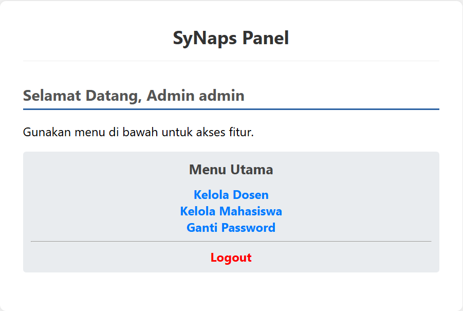
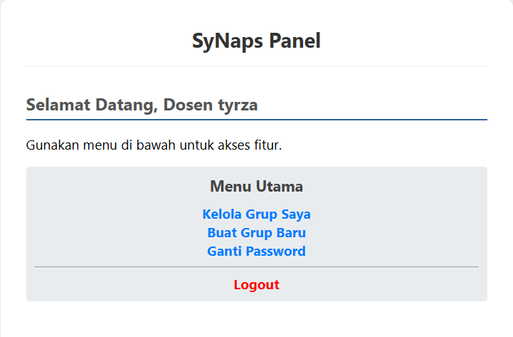
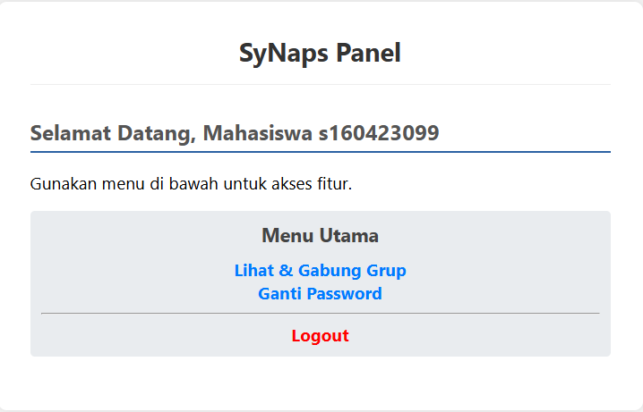
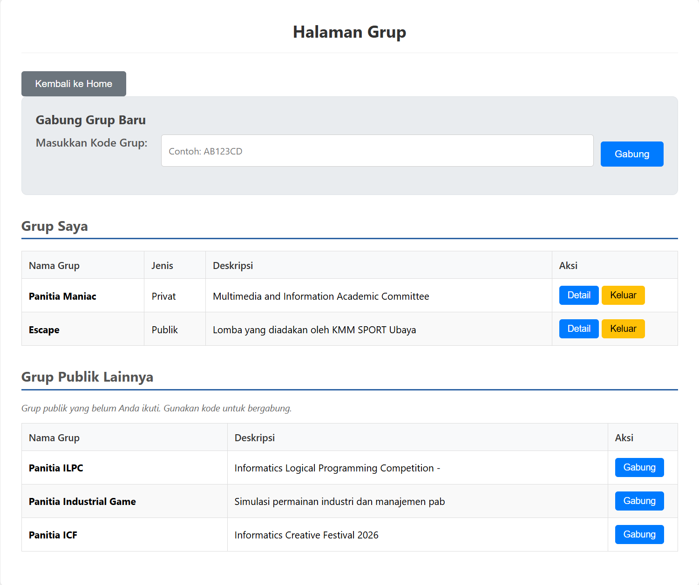
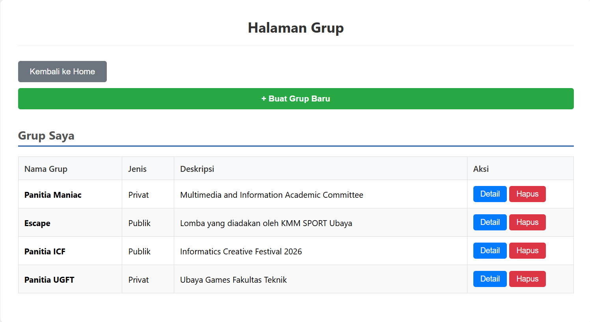
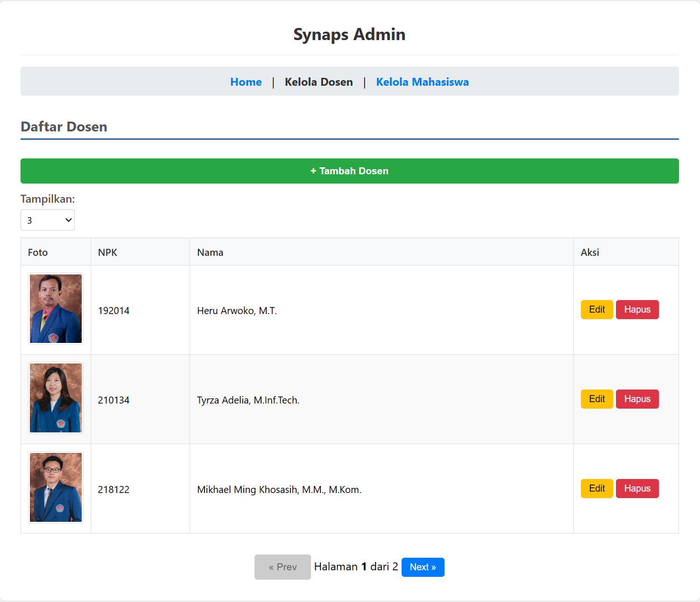

# Grouping System Web Application

Sebuah full-stack web application berbasis **PHP (OOP)**, **MySQL**, dan **AJAX**, yang digunakan untuk mengelola dosen, mahasiswa, grup, event, dan percakapan berbasis thread.  
Aplikasi ini dirancang untuk kebutuhan internal kampus, dengan fitur berbeda untuk **Admin**, **Dosen**, dan **Mahasiswa**.

---

# Features

## Admin
- CRUD Dosen (foto, identitas, pagination)
- CRUD Mahasiswa (foto, identitas, pagination)
- Reset / ganti password
- Dashboard navigasi sederhana

---

## Dosen
- Melihat grup yang dimiliki
- Membuat grup baru (Publik / Privat)
- Mengedit informasi grup
- Menambah / menghapus member (mahasiswa & dosen)
- Membuat dan mengelola event
- Membuat dan mengelola thread diskusi
- Kode pendaftaran grup otomatis

---

## Mahasiswa
- Join grup menggunakan kode unik
- Lihat daftar grup milik sendiri
- Lihat grup publik lainnya
- Keluar dari grup
- Akses detail grup (event, member)
- Ganti password

---

## AJAX Thread & Chat
- Real-time pull (tanpa refresh halaman)
- Bubbles pesan berbeda untuk pengirim vs penerima
- Auto-scroll
- Timestamp & sender identity
- Thread dapat dibuka/ditutup oleh dosen

---

# Tech Stack

| Layer | Teknologi |
|-------|-----------|
| Backend | PHP (OOP), MySQL |
| Frontend | HTML, CSS (native) |
| AJAX | jQuery |
| Database Tool | MySQL Workbench |
| Server | Apache (XAMPP) |

---

## Project Structure

### `/src`
Berisi seluruh kode aplikasi:
- `/ajax` — Handler untuk request AJAX (join group, chat, dll.)
- `/class` — Seluruh class OOP untuk entity (User, Group, Event, Member, dll.)
- `/images` — Foto dosen dan mahasiswa
- `index.php` — Halaman utama berdasarkan role login
- `login.php` — Halaman login
- `*.php` — Semua halaman fitur (CRUD, detail grup, event, thread, dsb.)
- `style.css` — Styling utama aplikasi

---

### `/database`
Semua file yang berkaitan dengan basis data:
- `fullstack.sql` — Struktur database + data awal
- `erd.png` — Diagram ERD relasi tabel

---

### `/docs`
Dokumentasi tambahan:
- `/screenshots` — Semua screenshot tampilan aplikasi (admin, dosen, mahasiswa, grup, dsb.)

---

### Root Folder
- `README.md` — Dokumentasi lengkap proyek

---

# Database Design  
ERD tersedia di:

Relasi utama meliputi:
`dosen`, `mahasiswa`, `grup`, `event`, `grup_member`, `thread`, `chat`, dan `user`.

---

# Screenshots

## User Panels

### 🔹 Panel Admin

### 🔹 Panel Dosen

### 🔹 Panel Mahasiswa

---

## Group Management & Details

### 🔹 Detail Grup (Dosen)

### 🔹 Detail Grup (Mahasiswa)

### 🔹 Halaman Grup (Mahasiswa)

### 🔹 Halaman Grup (Dosen)

---

## User Management

### 🔹 Daftar Dosen

### 🔹 Daftar Mahasiswa

---

# Cara Menjalankan Aplikasi

1. Clone repository  
2. Pindahkan folder `src/` ke dalam `htdocs` (Jika memakai XAMPP)  
3. Import file database:
database/fullstack.sql

4. Atur konfigurasi database pada:
5. Jalankan Apache & MySQL  
6. Akses aplikasi:
http://localhost/grouping-system/src/login.php

---

# Default Accounts

**Admin**
- Username: `admin`
- Password: `admin`

**Dosen/Mahasiswa**  
- Dibuat otomatis dari data admin (CRUD)

---

# Author
**Agnesha Riby Tjoanda**  
Informatics Engineering — Universitas Surabaya  

---

# License
Open for learning & educational purposes.

